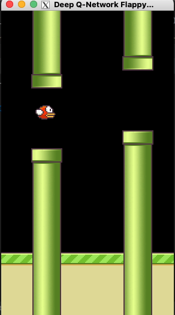

# INFO1111-Level-1

### File Structure
`Code of training and testing` is on the root folder with some elememens in `tools` and `model_save` and `assets` folder

`Demo video` is in the `demo_video` folder

`Reinfoecement learning notes` is in the `Notes` folder

### Training and Testing
requirement:
`pytorch
cv2
pygame
cuda`

To train the model, use `python train.py`

To test, use `python test.py`, and make sure the model is in the model_save folder

